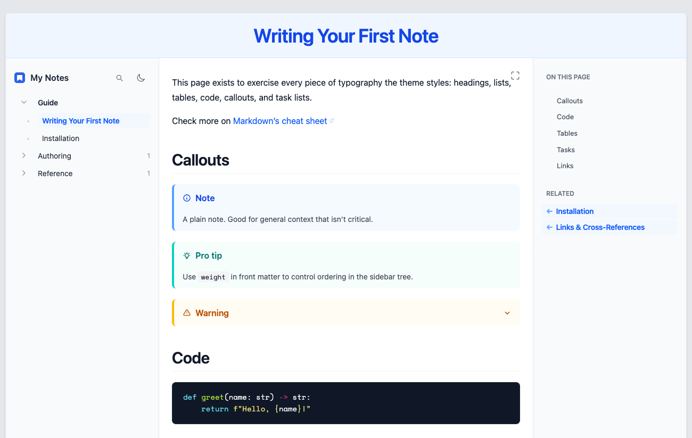

# hugo-emanote

A Hugo theme that reproduces the look & feel of [Emanote](https://emanote.srid.ca)'s default theme

This is an independent Hugo templates. It contains none of Emanote's original Haskell/Heist source, only the visual language (layout, spacing, color roles, typography) has been carried over.

Demonstration : [https://kbrault.github.io/hugo-emanote/](https://kbrault.github.io/hugo-emanote/)



## Quick start

```bash
git clone  https://github.com/kbrault/hugo-emanote .
```

`hugo.toml`:

```toml
theme = "hugo-emanote"

[outputs]
  home = ["HTML", "RSS", "JSON"]   # JSON powers the Ctrl+K search

[params]
  primaryColor = "blue"             # any Tailwind color name
  description  = "My notes"
  iconUrl      = "favicon.svg"

[taxonomies]
  tag = "tags"

[markup.goldmark]
  [markup.goldmark.parser]
    [markup.goldmark.parser.attribute]
      block = true
      title = true

# Optional but recommended: makes code blocks use this theme's shipped
# static/css/chroma.css (a "monokai" palette tuned for the always-dark
# code-block background) instead of Hugo's default inline-styled colors.

[markup.highlight]
  noClasses = false
  style = "monokai"
```

## Configuration

All params live under `[params]` in `hugo.toml`. See `/content/reference/params.md`

| Parameter                 | Type   | Default              | Purpose                                                                                   |
|---------------------------|--------|----------------------|-------------------------------------------------------------------------------------------|
| `primaryColor`            | string | `blue`               | Tailwind palette name used for the `primary-*` role throughout the theme |
| `description`             | string | -                    | Fallback meta description |
| `iconUrl`                 | string | `favicon.svg`        | Site icon shown in the sidebar, breadcrumbs, and browser tab |
| `relatedCount`            | int    | `5`                  | Max number of "Related" notes shown per page |
| `footerText`              | string | `Built with Hugo …`  | Text shown at the right of the footer strip |
| `sidebar.enable`          | bool   | `true`               | Show the left sidebar tree (overridable per page via front matter `sidebar: false`) |
| `breadcrumbs.enable`      | bool   | `true`               | Show the mobile breadcrumb bar |
| `toc.enable`              | bool   | `true`               | Show the right-panel table of contents (overridable per page via `toc: false`) |


## Content authoring

- **Ordering**: the sidebar tree and section listings sort with Hugo's normal page sort, set `weight:` in front matter for manual ordering.
- **Tags**: add `tags: ["a", "b"]` to front matter; they render as chips at the bottom of the note and feed the "Related" panel.
- **Callouts**: use the `callout` shortcode `{}body{}`. Types: `note`, `info`, `tip`, `warning`, `danger`, `success`, `quote`, `example`. Add `fold="true"` for a collapsed-by-default `<details>` callout.
- **Search**: works out of the box once `JSON` is in the home page's `[outputs]`, no extra setup.

## Design notes & deliberate differences

A few things in Emanote don't have a native Hugo equivalent and were adapted rather
than faked:

- Backlinks → "Related". 
- Folgezettel tree semantics.
- Tailwind is loaded from a CDN.
- Mona Sans is loaded via a Fontsource CDN build for convenience. Self-host it for production.
- Stork/WASM search is replaced with a small vanilla-JS Ctrl+K modal reading a generated `/index.json`.

## Compiling Tailwind locally (optional)

For production, or to drop the CDN script entirely:

```bash
npm install -D @tailwindcss/cli @tailwindcss/postcss
```

Move the contents of `layouts/partials/theme-tokens.html`'s `<style type="text/tailwindcss">` block into a `styles/input.css`, add `@import "tailwindcss";` at the top, then:

```bash
npx @tailwindcss/cli -i styles/input.css -o static/css/main.css --minify
```

Replace the `<script src=".../@tailwindcss/browser@4">` tag in `layouts/partials/head.html` with `<link rel="stylesheet" href="{{ "css/main.css" | relURL }}">`.

## Self-hosting fonts

Download [Lora](https://fonts.google.com/specimen/Lora), [Space Mono](https://fonts.google.com/specimen/Space+Mono), and [Mona Sans](https://github.com/github/mona-sans) (woff2), place them under `static/fonts/`, and replace the `<link>` tags in `layouts/partials/styles.html` with local `@font-face` rules pointing at `/fonts/...`.

## License

MIT for the templates in this repository. Design language credited to Emanote https://github.com/srid/emanote.
